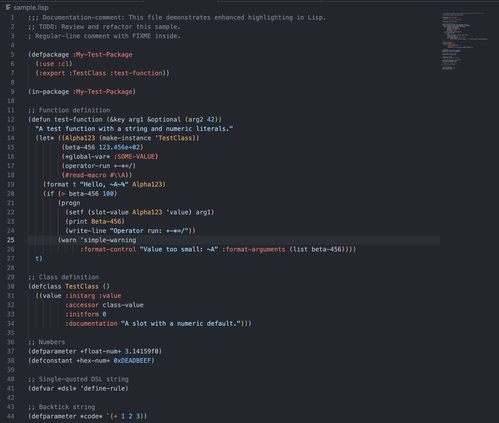

# LispSxpr - Lisp Syntax Highlighting for VS Code

A LISP syntax highlighting extension for VS Code that provides rich syntax highlighting features for various LISP dialects and S-expression-based languages.

## Screenshot



## Features

### Syntax Highlighting

- **Bracket Emphasis**: Visual emphasis for bracket pairs `()`, `[]`, `{}`
- **Keywords**: Highlights keywords in `:keyword` and `::keyword` formats
- **Identifier Differentiation**: Visual distinction for identifiers with varying capitalization
- **Numeric Literals**: 
  - Integers
  - Floating-point numbers
  - Hexadecimal numbers (`0xDEADBEEF`)
  - Scientific notation (`123.456e+02`)
- **Operators**: Standalone operator blocks (`+-*/`)
- **Strings**: 
  - Double-quoted strings
  - Single-quoted strings
  - Backtick-quoted strings
- **Comments**:
  - Regular comments (`;`)
  - Documentation-style comments (`;;`)
  - Emphasis for `TODO`/`FIXME` in comments
  - Block comments (`#| ... |#`)
- **Constants**: Highlighting for constants like `true`, `false`, `null`

### Markdown Code Block Support

Syntax highlighting is also enabled for LISP code blocks (````lisp` or ````emacs-lisp`) within Markdown files.

## Supported File Extensions

Syntax highlighting is automatically applied to files with the following extensions:

- `.lisp` - Common Lisp
- `.cl` - Common Lisp
- `.asd` - ASDF system definitions
- `.ros` - Roswell scripts
- `.lsp` - LISP source
- `.el` - Emacs Lisp
- `.fnl` - Fennel
- `.clj` - Clojure
- `.mal` - Make a Lisp
- `.sxpr` - S-expressions
- `.hlir` - HLIR

## Installation

### Install from VS Code

1. Open VS Code
2. Open the Extensions view (`Cmd+Shift+X` / `Ctrl+Shift+X`)
3. Search for "LispSxpr"
4. Click the Install button

### Manual Installation

You can download a `.vsix` file and install it using the following command:

```bash
code --install-extension LispSxpr-0.2.1.vsix
```

## Usage

After installing the extension, syntax highlighting is automatically applied when opening files with the supported extensions. No special configuration is required.

## Developer Information

- **Author**: Yasuo Higano
- **Version**: 0.2.1
- **License**: MIT

## License

MIT License - See the [LICENSE](LICENSE) file for details.

## Bug Reports

If you discover any bugs, please report them on [Issues](https://github.com/Yasuo-Higano/vscode-lisp-sxpr-highlighting/issues).
